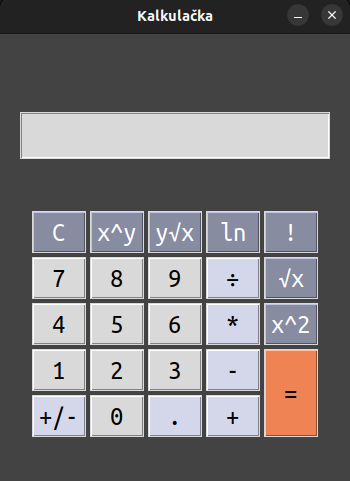

# Kalkulačka
Tato softwarová aplikace je kalkulačka, která umožňuje provádět základní matematické operace, jako jsou sčítání, odčítání, násobení, dělení a funkce mocniny, odmocniny, přirozeného logaritmu a faktoriálu.
<br><br><br>


## Vytvořeno s využitím
<a href="https://www.python.org/">

</a>
<br>
<a href="https://docs.python.org/3/library/tkinter.html">

</a>
<br>
<br>

## Instalace
```sh
$ make
```
<br>

## Použití
### 2 operandy
1. Výber prvního čísla
2. Výber dvou operandové operace
3. Výber druhého čísla
4. Výber znaku rovnosti
### 1 operand
1. Výber čísla
2. Výber jedno operandové operace

## Licence
saddasda

## Kontakt
adsdasdasd