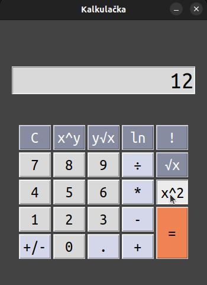

# Kalkulačka
Tato softwarová aplikace je kalkulačka, která umožňuje provádět základní matematické operace, 
jako jsou sčítání, odčítání, násobení, dělení a funkce mocniny, odmocniny, přirozeného logaritmu a faktoriálu.
<br><br><br>


## Vytvořeno s využitím
<a href="https://www.python.org/">

</a>
<br>
<a href="https://docs.python.org/3/library/tkinter.html">

</a>
<br>
<br>

## Prostředí
- Ubuntu 64bit

## Prerekvizity
Před spuštěním kalkulačky je třeba mít nainstalován balík `python3` a `python3-tk`.

```sh
sudo apt install python3 && sudo apt install python3-tk
```

(také je možno využít `make all`, který závislosti nainstaluje)

## Spuštění kalkulačky bez instalace

Kalkulačku lze spustit ze složky `src` přes makefile příkazem `make run` popřípadě příkazem `python3 calc_view.py`.

## Spuštění programu pro výpočet odchylky bez instalace

Program pro výpočet odchylky lze spustit ze složky `src` příkazem `python3 stddev.py`

### Příklad spuštění
```sh
$ python3 stddev.py < input_numbers.txt
...
$ echo "123 456 789" | python3 stddev.py
```

## Automatická instalace kalkulačky

```sh
sudo dpkg -i ivscalc_01_amd64.deb
```

## Automatická odinstalace kalkulačky

```sh
sudo apt remove ivscalc
```

## Automatická instalace programu pro výpočet odchylky

```sh
sudo dpkg -i stddev_01_amd64.deb
```

## Automatická odinstalace programu pro výpočet odchylky

```sh
sudo apt remove stddev
```

## Manuální instalace kalkulačky
1. Zkopírujte zdrojové soubory uvedenz níže do složky /usr/opt/ivscalc.
- `src/calc_view.py`
- `src/math_lib.py`
- `src/colors.py`
2. Zkopírujte ikonu aplikace: `src/icons/ivscalc-96.png` do složky `/usr/share/icons/hicolor/96x96/apps`
3. Zkopírujte spouštěcí skript: `/src/ivscalc` do složky `/usr/bin`. Toto zajistí spuštění aplikace z terminálu.
4. Pro přidání zástupce do aplikačního menu zkopírujte soubor `src/ivscalc.desktop` do složky `/usr/share/applications`.
5. Kalkulačku nyní můžete spustit příkazem `ivscalc` z terminálu nebo přes zástupce v aplikačním menu.

## Manuální odinstalace kalkulačky

1. Smažte složku `/usr/opt/ivscalc` a ikonu `ivscalc-96.png` ze složky `/usr/share/icons/hicolor/96x96/apps`.
2. Smažte spouštěcí skript `ivscalc` ze složky `/usr/bin`.
3. Pro odstranění zástupce smažte soubor `ivscalc.desktop` ze složky `/usr/share/applications`.

## Manuální instalace programu pro výpočet odchylky
1. Zkopírujte zdrojové soubory uvedeny níže do složky `/usr/opt/stddev`:
- src/stddev.py
- src/math_lib.py
2. Zkopírujte spouštěcí skript: `/src/stddev` do složky `/usr/bin`. Toto zajistí spuštění aplikace z terminálu.

## Manuální odinstalace programu pro výpočet odchylky
1. Smažte složku /usr/opt/stddev
2. Smažte spouštěcí skript stddev ze složky /usr/bin.


## Použití

### 2 operandy
1. Výber prvního čísla
2. Výber dvou operandové operace (+, -, *, ÷, x^y, y√x)
3. Výber druhého čísla
4. Výber znaku rovnosti


<br><br>


### 1 operand
1. Výber čísla
2. Výber jedno operandové operace (ln, √x, x^2, !, +/-)


<br><br>


## Licence
Tento program je poskytován pod licencí GNU GPL verze 3.

## Autoři
- xpodvo00, Lukáš Podvojský 
- xuhrec00, Michal Uhrecký 
- xforma19, David Formánek 
- xistva03, Jaroslav Ištvan